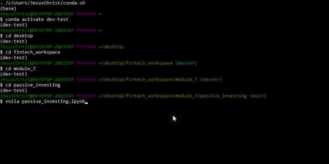
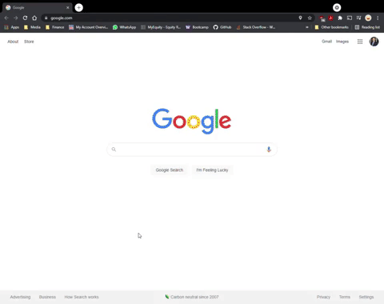

Module 7 - Challenge 7 : Passive Investing
==========================================

## Purpose

 The purpose of this notebook is to build a financial database and web application by using SQL, Python, and the Voilà library, and then analyze the performance of a hypothetical fintech ETF.

---

## Technologies

Jupyter notebooks and the Pandas data analysis library were used in the creation of this project. .

---

## Installation Guide

First, install the jupyter and pandas libraries. In your terminal or command shell install the following packages: 

```python
pip install jupyter
```

```python
pip install pandas
```

```python
pip install numpy
```

```python
pip install hvplot
```

```python
pip install sqalchemy
```

Additionally Voila was used to create a interactive visualization for the project.

This notebook was created using python 3.7.10. There were a number of issues with the packages within this specific conda environment, and I definitely recommend taking time to troubleshoot any package discrepencies that may arise. 

---
## Demonstration

In the terminal type the following:

```python
voila passive_investing.ipynb
```

]

The results should then display in your browser as follows:



---
## Conclusion

Contained within the notebook are the results of the analysis. 

---

## Contributors

Created by: Chris Henderson

cdhendy@gmail.com

[LinkedIn](https://www.linkedin.com/in/chris-henderson123/)

---

## License

(c) Copyright 2021 Chris Henderson

Licensed under the MIT license:

    http://www.opensource.org/licenses/mit-license.php

Permission is hereby granted, free of charge, to any person obtaining a copy
of this software and associated documentation files (the "Software"), to deal
in the Software without restriction, including without limitation the rights
to use, copy, modify, merge, publish, distribute, sublicense, and/or sell
copies of the Software, and to permit persons to whom the Software is
furnished to do so, subject to the following conditions:

The above copyright notice and this permission notice shall be included in
all copies or substantial portions of the Software.

THE SOFTWARE IS PROVIDED "AS IS", WITHOUT WARRANTY OF ANY KIND, EXPRESS OR
IMPLIED, INCLUDING BUT NOT LIMITED TO THE WARRANTIES OF MERCHANTABILITY,
FITNESS FOR A PARTICULAR PURPOSE AND NONINFRINGEMENT. IN NO EVENT SHALL THE
AUTHORS OR COPYRIGHT HOLDERS BE LIABLE FOR ANY CLAIM, DAMAGES OR OTHER
LIABILITY, WHETHER IN AN ACTION OF CONTRACT, TORT OR OTHERWISE, ARISING FROM,
OUT OF OR IN CONNECTION WITH THE SOFTWARE OR THE USE OR OTHER DEALINGS IN
THE SOFTWARE.